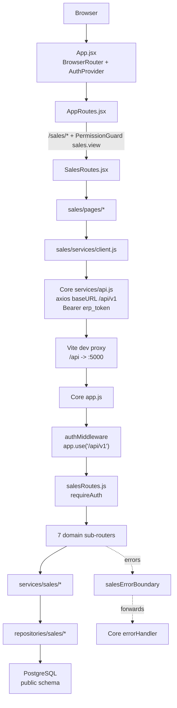

# PH1 Handover — Integration Architecture & Runtime
**Document ID:** PH1-HANDOVER-004
**Date:** 2026-09-17
**Scope:** How the PH1 Sales module is mounted into ERP Core, its runtime configuration, the standalone architecture it replaced, its cross-module boundaries, and the runbook to start and verify it.
**Provenance:** every claim below is derived from the cited source files at the commit in the working tree.

---

## 1. Architecture



Reading the flow: Core owns the shell and identity (`App.jsx` mounts `BrowserRouter` + `AuthProvider` at `frontend/src/App.jsx:5-11`; auth state lives in `components/rbac/AuthContext`). The module is one guarded subtree (`frontend/src/sales/SalesRoutes.jsx`), calling Core's single Axios instance. In the browser the Vite proxy makes the API same-origin; in production the browser hits the backend directly. Every sales endpoint passes Core's `authMiddleware` under `/api/v1`, then the module's own `requireAuth`, then one of seven domain sub-routers, then a service and a repository that issue unqualified SQL against `erp_may10.public` (`docs/ph1-remediation/DB_COMPATIBILITY_MATRIX.md:7,19`).

---

## 2. Mount Points

Exactly three integration edits connect the module to Core. They are the only Core files the module changes, per `docs/ph1-remediation/BASELINE.md` §4.4.

| # | Edit | File:line | Exact form |
|---|---|---|---|
| 1 | Frontend route mount | `frontend/src/routes/AppRoutes.jsx:59-70` | `<Route path="sales/*" element={<PermissionGuard permission="sales.view" redirect={true} fallback={<Forbidden />}><SalesRoutes /></PermissionGuard>} />` — replaces the PH1 `<PlaceholderModule />` stub |
| 2 | Sidebar menu registration | `frontend/src/config/menu.js:19-73` | Group `KINH DOANH` (group permission `sales.view`), 7 items (Tổng quan bán hàng, Khách hàng, Sản phẩm, Bán hàng & Đơn hàng, Giao hàng, Hóa đơn bán hàng, Công nợ phải thu), each `permission: 'sales.view'` |
| 3 | Backend router mount | `backend/src/app.js:18` (require) and `backend/src/app.js:82` | `app.use('/api/v1/sales', salesRoutes);` |

- The route mount keeps the guard `sales.view` (`BASELINE.md` §4.4 ruling R-1: the contract's `ban_hang.view` prefix is waived for PH1; no Core file is edited to rename it).
- The backend mount sits at line 82 **before** the PH5 catch-all `app.use('/api', authMiddleware, requireRoles('ke_toan', 'ke_toan_truong'), financeRoutes)` at `app.js:83` — order is load-bearing, because `/api` would otherwise swallow `/api/v1/sales` (comment `app.js:81`).
- Nothing else in Core is touched. `BASELINE.md` §4.1 (Core platform), §4.2 (PH4 Kho), §4.3 (PH5 Tài chính) are frozen; the module's own code is new under `frontend/src/sales/*` and `backend/src/{routes,sales,services/sales,repositories/sales,utils/sales}/*` (`BASELINE.md` §4.5).

---

## 3. Runtime Configuration

### 3.1 Environment variables the module reads

Values below are from the gitignored `backend/.env` (`backend/.env:1-10`) and the code that consumes them.

| Key | Dev value in `backend/.env` | Consumer | Note |
|---|---|---|---|
| `NODE_ENV` | `development` | `app.js:53` | When `test`, Morgan request logging is skipped |
| `PORT` | `5000` | `backend/src/server.js:5` (`process.env.PORT \|\| 5000`) | Must equal the Vite proxy target (`backend/.env` note, `frontend/vite.config.js:10`) |
| `DB_HOST` | `127.0.0.2` | `config/database.js:27` (`resolveHost()`, `:6-24`) | Explicit loopback alias — see §3.3 |
| `DB_PORT` | `55432` | `config/database.js:28` | Disposable local dev DB port |
| `DB_NAME` | `erp_sales_crm_dev` | `config/database.js:31` | Same schema as `erp_may10` (`DB_COMPATIBILITY_MATRIX.md:7`) |
| `DB_USER` | `postgres` | `config/database.js:29` | |
| `DB_PASSWORD` | `postgres_dev_password` | `config/database.js:30` | Dev only |
| `TAX_RATE` | `0` | `config/sales.js` | Module business switch |
| `CREDIT_LIMIT_MODE` | `warning` | `config/sales.js` | Module business switch |
| `CORS_ORIGINS` | `http://localhost:5173,http://127.0.0.1:5173` | `app.js:34-36` | Comma-split allowlist; absent → built-in localhost defaults |

- **DB defaults** when an env var is missing: `database.js:28-31` falls back to `5432` / `postgres` / `postgres` / `erp_may10`. `DB_HOST` is resolved by `resolveHost()` (`database.js:6-24`): a non-`localhost`/`127.0.0.1` value is used verbatim.
- **CORS:** `app.js:39-49` allows requests with no `Origin` or an origin in the allowlist, with `credentials: true`; any other origin is rejected with `CORS Not Allowed: Origin is not in trusted allowlist`.
- **`ERP_AUTH_SECRET` handling:** `backend/.env` does not set it. `backend/src/middlewares/auth.js:37` falls back to a **built-in development signing key** (not reproduced here — never copy it into a shared environment) and signs HMAC-SHA256 tokens of the form `erp_token_{userId}_{timestamp}.{signature}` (`auth.js:40-49`). **A real `ERP_AUTH_SECRET` MUST be injected before any shared environment** (`STEP6_FRONTEND_EVIDENCE.md` §5).
- Identity headers `x-role` / `x-user-id` sent by the Core client (`frontend/src/services/api.js:13-19`) are **not trusted**; identity is derived only from the server-verified token (`auth.js:93-111`, `INTEGRATION_BOUNDARIES.md` §4.4).

### 3.2 Vite proxy relationship

`frontend/vite.config.js` runs the dev server on port `5173` and proxies `/api` to `http://localhost:5000` with `changeOrigin: true` (`vite.config.js:6-13`). Core's Axios client uses `baseURL: '/api/v1'` (`frontend/src/services/api.js:3-7`), so in development the browser calls `/api/v1/sales/...` same-origin and Vite forwards it to the backend on `:5000`; CORS is then not exercised. If the browser calls the API directly (no proxy), the calling origin must appear in `CORS_ORIGINS`. **Verified configuration (2026-09-17):** the running dev server is the `frontend` project process on **5173** (`hub ps`), inside the allowlist above; a second server on another port (e.g. the stale `ph1-frontend` on 5174) is *not* allow-listed, and browser traffic would still work only because of the same-origin proxy. Backend suites call the API from Node with no `Origin` header.

### 3.3 Dev-database caveat and the `erp_may10` credential note

- `backend/.env` deliberately targets the disposable local dev database on `127.0.0.2:55432` (`erp_sales_crm_dev`), not `erp_may10`. `TAX_RATE` and `CREDIT_LIMIT_MODE` are module policy switches (`config/sales.js`).
- **Dev-database caveat (`TARGET_DESIGN.md` §7.2, item 6 — the note the assignment labels §7.2.6):** "`erp_may10` itself was not reachable with the available credentials (28P01), and Core's `config/database.js` probes WSL for `localhost`, so an explicit loopback alias is used. Steps 10-11 need the owner's `erp_may10` credentials."
- `DB_HOST` is an explicit non-localhost loopback address because `config/database.js` otherwise probes WSL for the DB host (`backend/.env` header comment; `database.js:6-24`).

---

## 4. Retired Standalone Architecture

The standalone PH1 app was not carried over wholesale. The following were intentionally dropped; each is listed in `BASELINE.md` §4.6 and `TARGET_DESIGN.md` §7.3.

| Retired standalone PH1 component | Reason (one line) |
|---|---|
| `frontend/src/components/common/AppShell.tsx` | Core's `MainLayout`/`Header`/`Sidebar` owns the shell (`BASELINE.md` §4.6) |
| `frontend/src/pages/auth/LoginPage.tsx` | Core provides the single `/login` page (`BASELINE.md` §4.6) |
| `frontend/src/context/AuthContext.tsx` | Core's `components/rbac/AuthContext` owns auth state (`BASELINE.md` §4.6) |
| `frontend/src/services/api.ts` (fetch client) | Replaced by Core's Axios instance `services/api.js` (`BASELINE.md` §4.6) |
| `backend/src/server.ts` / `app.ts` bootstrap | Core owns `server.js`/`app.js` lifecycle (`BASELINE.md` §3.1, §4.6) |
| PH1 JWT auth (`auth.routes.ts`, `auth.service.ts`, `auth.middleware.ts`, `jsonwebtoken`) | Core-issued HMAC-SHA256 tokens via `middlewares/auth.js` are the sole security authority (`INTEGRATION_BOUNDARIES.md` §2.1) |
| PH1 failure envelope `{ error: { code } }` | Contract §9.3 flat envelope `{ success, message, errorCode, details }` (`STEP5_BACKEND_EVIDENCE.md` §3 D3; `TARGET_DESIGN.md` §7.2 item 2) |

Also not carried: PH1's own `env`/pool (`config/env.ts`, `config/database.ts`), its type/model files, and the 49 zero-byte legacy CommonJS stubs inherited from `main` (`TARGET_DESIGN.md` §7.3).

---

## 5. Cross-Module Boundaries

Source: `docs/ph1-remediation/INTEGRATION_BOUNDARIES.md`.

### 5.1 PH4 — Kho & Quản lý vật tư (frozen, `§4.2`)

| Allowed (read) | Forbidden (never write) |
|---|---|
| Warehouse master data `kho`, filtered `trang_thai = 'hoat_dong'` for delivery validation (`INTEGRATION_BOUNDARIES.md` §2.3, §3.2) | Insert/update any warehouse record (`kho`, `vi_tri_kho`, `vat_tu`, `lo_vat_tu`, `ton_kho`) (`§2.3`) |
| Product master `san_pham` fields `gia_ban`, `ma_don_vi_tinh`, `trang_thai = 'dang_ban'` (`§3.1`) | Mutate stock (`ton_kho`) or create warehouse notes (`phieu_xuat_kho`, …) through private repositories (`§2.3`) |
| Live inventory balance via Core API `GET /api/v1/ton-kho?ma_vat_tu=...` (`§3.1`) | Expose `san_pham.gia_von` on any Sales endpoint or query (`§3.1`, cost-security rule) |

- PH1 owns only `giao_hang` (shipping note tracking customer delivery) (`§2.3` item 2). Stock is never reserved or consumed by orders/deliveries (`KNOWN_GAPS.md` G-5).
- Delivery lifecycle transitions (`dang_giao`, `da_giao`, `that_bai`) are role-restricted to `kho` / `admin` (`§3.3`).
- No direct controller/service imports from PH4: interaction is strictly through database read models or Core HTTP extension points (`§4.1`).

### 5.2 PH5 — Tài chính / Kế toán (frozen, `§4.3`)

| Allowed (read) | Forbidden (never write) |
|---|---|
| `cong_no` **read-only**, filtered `loai_cong_no = 'phai_thu'` (`INTEGRATION_BOUNDARIES.md` §2.4) | Any payment creation or debt write-off endpoint (`§2.4` item 2) |
| Outstanding balances / overdue invoices for sales users (`§2.4` item 3) | Aging/adjustments beyond `ke_toan`/`admin` (aging requires `accounting.receivable`, ruling R-2) (`§2.4` item 3) |

- Never `require`/`import` PH5 internal controllers or services (`debtController.js`, etc.) (`§4.1`).
- The backend deliberately serves `kho` a fulfillment-scoped dashboard and `ke_toan` a finance scope, but Core's role map currently grants neither `sales.view` — see §7 G-7 (`KNOWN_GAPS.md` G-7).

### 5.3 Global dashboard boundary

Core retains ownership of the root homepage `/` and the global dashboard (`frontend/src/pages/Dashboard.jsx`); PH1 must not override it. Sales metrics live strictly under `/api/v1/sales/tong-quan/*` and render at `/sales` (`INTEGRATION_BOUNDARIES.md` §2.2).

---

## 6. Runbook

All commands run from the repository root unless noted. Every command below is an existing script or file in the tree.

### 6.1 Start the backend

```bash
cd backend
node src/server.js          # production-style start; PORT from backend/.env (5000)
# equivalent npm script:  npm start
# watch mode (npm script): npm run dev        -> node --watch src/server.js
```

Startup banner and health URL are printed by `backend/src/server.js`; the health probe is `GET /api/v1/health` (`app.js:58-65`).

### 6.2 Start the frontend

```bash
cd frontend
npm run dev                 # vite, port 5173 (vite.config.js), /api proxied to :5000
# production build (also the module's Core build verification): npm run build
```

### 6.3 Verify the module

| Suite | Command | Source |
|---|---|---|
| Backend module regression (API/RBAC/envelopes) | `cd backend && node tests/test_ph1_sales_api.js` | file `backend/tests/test_ph1_sales_api.js`; invoked in `STEP5_BACKEND_EVIDENCE.md` §4 and `STEP6_FRONTEND_EVIDENCE.md` §3.2 |
| Frontend build-only verification (ruling R-4) | `cd frontend && npx vite build` | `STEP6_FRONTEND_EVIDENCE.md` §3.1 — the module's frontend exit criterion |
| Module loads standalone | `cd backend && node -e "require('./src/routes/salesRoutes.js')"` | `STEP5_BACKEND_EVIDENCE.md` §4 |

There is no npm script alias for the PH1 suite (`backend/package.json` defines `test:api` → `tests/test_ph4_api.js` and `test:concurrency`; neither is the PH1 module suite). Invoke the PH1 file directly as above.

### 6.4 Hit an endpoint from a fresh start

`test_ph1_sales_api.js` self-mints Core-signed tokens, so no credentials are needed to exercise the API (`STEP6_FRONTEND_EVIDENCE.md` §5). For a manual browser check, log in through Core `/login` and open `/sales` (requires `sales.view`; see §7). Verify the API directly with a Core-issued token:

```bash
curl -H "Authorization: Bearer <erp_token>" http://localhost:5000/api/v1/sales/tong-quan/summary
```

---

## 7. Open Items

Both items below require an **owner action**; neither is resolved by the module.

### 7.1 G-7 — only `admin`/`ban_hang` reach the Sales UI (owner decision)

Copied from `docs/ph1-remediation/KNOWN_GAPS.md` G-7:

> **Where:** Core `backend/src/config/roleMapping.js` — `sales.view` is granted by `ADMIN_PERMISSIONS` and `SALES_PERMISSIONS` only; `KHO_PERMISSIONS`, `ACCOUNTING_PERMISSIONS`, `PRODUCTION_PERMISSIONS` and `PURCHASING_PERMISSIONS` do not have it. The module gate is `<PermissionGuard permission="sales.view">` (`frontend/src/routes/AppRoutes.jsx` → `frontend/src/sales/SalesRoutes.jsx`).
>
> **Consequence:** the module's client-side role scopes are exercised only for `admin`/`ban_hang`: the `ke_toan` finance view (money metrics + receivables note) and the `kho` fulfillment view (status counts, money hidden, "quản trị viên và kế toán" note) cannot be reached, because those accounts never get past the module gate. Server-side scope masking is unaffected and remains enforced (and tested) regardless of what the UI shows.
>
> **Disposition:** **owner decision.** Options: (a) add `sales.view` to `KHO_PERMISSIONS`/`ACCOUNTING_PERMISSIONS` …, or (b) introduce narrower permissions (e.g. `sales.dashboard`, `sales.delivery`, `sales.finance`) and point the route guards and menu entries at them. Recommended: (b) …. The module guard stays `sales.view` until the ruling lands (ruling R-1).

**Owner action:** choose option (a) or (b); if (b), the route guards in `AppRoutes.jsx:63` and the menu entries in `menu.js` must be repointed.

### 7.2 `erp_may10` credentials (owner action)

Copied from `docs/ph1-remediation/TARGET_DESIGN.md` §7.2, item 6:

> `backend/.env` (gitignored) points the integrated workspace at the disposable local dev database on `127.0.0.2:55432`; `erp_may10` itself was not reachable with the available credentials (28P01), and Core's `config/database.js` probes WSL for `localhost`, so an explicit loopback alias is used. **Steps 10-11 need the owner's `erp_may10` credentials.**

**Owner action:** supply working `erp_may10` connection credentials so the module can be pointed at the integration database (then update `backend/.env` `DB_*` values).
