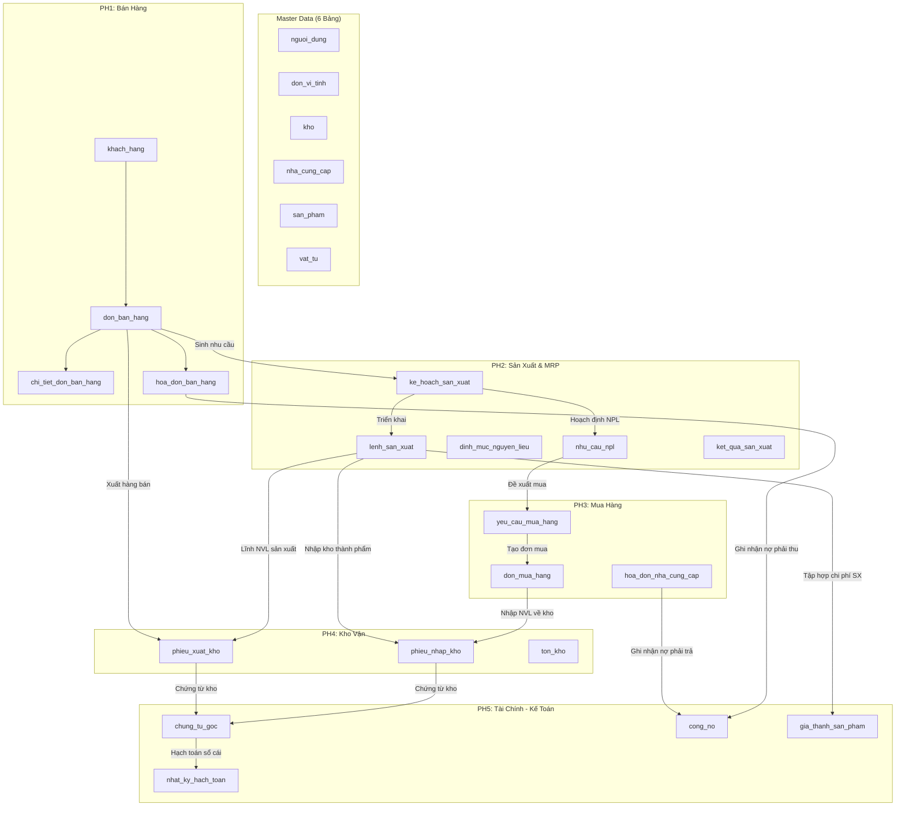

# 01 — KIẾN TRÚC CƠ SỞ DỮ LIỆU CHUNG HỆ THỐNG ERP MAY 10

## 1. Tổng Quan Kiến Trúc
Hệ thống ERP May 10 được thiết kế theo mô hình **Cơ sở dữ liệu tập trung (Single Shared Database)** trên nền tảng **PostgreSQL 18**.
Toàn bộ 5 phân hệ nghiệp vụ cùng chia sẻ một không gian dữ liệu duy nhất (`erp_may10`), kết nối trực tiếp thông qua các ràng buộc khóa ngoại (Foreign Keys), đảm bảo tính toàn vẹn và nhất quán của toàn bộ luồng quy trình sản xuất kinh doanh dệt may.

```
                           ERP MAY 10
                               |
                    DATABASE CHUNG (erp_may10)
                               |
    +-----------+-----------+--+--------+-----------+
    |           |           |           |           |
   PH1         PH2         PH3         PH4         PH5
 Bán hàng    Sản xuất    Mua hàng       Kho      Tài chính
```

### Nguyên tắc kiến trúc cốt lõi:
1. **Không phân mảnh database**: Tuyệt đối không tạo các database độc lập như `sales_db`, `production_db`, `purchase_db`, `warehouse_db`, `finance_db`.
2. **Master Data duy nhất (6 bảng)**: Tất cả phân hệ dùng chung 6 bảng danh mục nền tảng: Người dùng (`nguoi_dung`), Đơn vị tính (`don_vi_tinh`), Kho (`kho`), Nhà cung cấp (`nha_cung_cap`), Sản phẩm (`san_pham`), Vật tư (`vat_tu`).
3. **Loại bỏ trùng lặp đối tượng**:
   - Loại bỏ các bảng phụ trùng lặp từ các phân hệ cũ (`users`, `products`, `warehouses`, `goods_receipts`, `sales_orders`, `invoices`, `NguoiDung`, `SanPhamMayMac`, `DonHangMayMac`, `NhanVienKeToan`).
   - Mọi phân hệ tham chiếu đến bảng gốc bằng khóa ngoại (`BIGINT`).
4. **Chuẩn hóa kiểu dữ liệu ngành may**:
   - Khóa chính: `BIGSERIAL PRIMARY KEY` (64-bit tự tăng, tương thích cao).
   - Khóa ngoại: `BIGINT` khớp hoàn toàn với bảng gốc.
   - Số lượng, định mức: `NUMERIC(18,3)` (chính xác đến 3 chữ số thập phân, bắt buộc cho định mức mét vải, cuộn chỉ, cúc áo).
   - Tiền tệ: `NUMERIC(18,2)` (chuẩn kế toán tài chính).
   - Thời gian: `TIMESTAMPTZ` (chuẩn múi giờ Việt Nam UTC+7, tránh sai lệch khi mở rộng).
   - Mã nghiệp vụ: `VARCHAR(50) UNIQUE NOT NULL` (định danh nghiệp vụ rõ ràng: `SP001`, `DH001`, `KHSX001`...).
   - Trạng thái: `VARCHAR(20)` linh hoạt mở rộng nghiệp vụ.
   - Ngôn ngữ: Tiếng Việt `snake_case`, không dấu, chữ thường toàn bộ schema.

---

## 2. Phân Bổ 41 Bảng Theo 5 Phân Hệ & Master Data

| Phân hệ / Nhóm | Số bảng | Danh sách các bảng |
|---|:---:|---|
| **Master Data (Dùng chung)** | **6** | `nguoi_dung`, `don_vi_tinh`, `kho`, `nha_cung_cap`, `san_pham`, `vat_tu` |
| **PH1 — Bán hàng & Khách hàng** | **5** | `khach_hang`, `don_ban_hang`, `chi_tiet_don_ban_hang`, `giao_hang`, `hoa_don_ban_hang` |
| **PH2 — Sản xuất & MRP** | **6** | `ke_hoach_san_xuat`, `dinh_muc_nguyen_lieu`, `lenh_san_xuat`, `cong_doan_san_xuat`, `nhu_cau_npl`, `ket_qua_san_xuat` |
| **PH3 — Mua hàng** | **7** | `yeu_cau_mua_hang`, `chi_tiet_yeu_cau_mua`, `don_mua_hang`, `chi_tiet_don_mua`, `hoa_don_nha_cung_cap`, `thanh_toan_ncc`, `danh_gia_ncc` |
| **PH4 — Kho & Quản lý vật tư** | **11** | `vi_tri_kho`, `lo_vat_tu`, `ton_kho`, `phieu_nhap_kho`, `chi_tiet_phieu_nhap`, `phieu_xuat_kho`, `chi_tiet_phieu_xuat`, `phieu_chuyen_kho`, `chi_tiet_chuyen_kho`, `phieu_kiem_ke`, `chi_tiet_kiem_ke` |
| **PH5 — Tài chính & Giá thành** | **6** | `he_thong_tai_khoan`, `chung_tu_goc`, `nhat_ky_hach_toan`, `cong_no`, `bao_cao_tai_chinh`, `gia_thanh_san_pham` |
| **TỔNG CỘNG** | **41** | **41 BẢNG CHUẨN HÓA (EXACT DATABASE CONTRACT)** |

---

## 3. Luồng Tích Hợp Dữ Liệu Xuyên Phân Hệ (Cross-Module Workflows)



1. **PH1 -> PH2**: Đơn bán hàng (`don_ban_hang`) liên kết trực tiếp tới Kế hoạch sản xuất (`ke_hoach_san_xuat`) và Lệnh sản xuất (`lenh_san_xuat`).
2. **PH2 -> PH3**: Kế hoạch sản xuất dựa trên BOM (`dinh_muc_nguyen_lieu`) sinh Nhu cầu NPL (`nhu_cau_npl`) -> tạo Yêu cầu mua hàng (`yeu_cau_mua_hang`).
3. **PH3 -> PH4**: Đơn mua hàng (`don_mua_hang`) khi NCC giao hàng sẽ tạo Phiếu nhập kho (`phieu_nhap_kho`) dùng chung.
4. **PH2 -> PH4**: Lệnh sản xuất (`lenh_san_xuat`) xuất nguyên phụ liệu qua Phiếu xuất kho (`phieu_xuat_kho`) và nhập thành phẩm may mặc qua Phiếu nhập kho (`phieu_nhap_kho`).
5. **PH1 -> PH4**: Đơn bán hàng hoàn thành xuất kho giao khách qua Phiếu xuất kho (`phieu_xuat_kho`) và Phiếu giao hàng (`giao_hang`).
6. **PH5 -> Toàn hệ thống**: Mọi chứng từ kinh tế (hóa đơn bán, hóa đơn mua, phiếu nhập, phiếu xuất) liên kết tới Chứng từ gốc (`chung_tu_goc`), sinh Bút toán hạch toán Nợ/Có (`nhat_ky_hach_toan`), theo dõi Công nợ tổng hợp (`cong_no`), và tính Giá thành sản phẩm (`gia_thanh_san_pham`).
