# 06 — SƠ ĐỒ THỰC THỂ LIÊN KẾT (ERD - ENTITY RELATIONSHIP DIAGRAM)

Tài liệu mô tả sơ đồ thực thể liên kết (ERD) hoàn chỉnh cho **chính xác 41 bảng** (gồm 6 bảng Master Data và 5 phân hệ) trong cơ sở dữ liệu `erp_may10`.

---

## 1. Sơ Đồ ERD Tổng Thể Toàn Hệ Thống (Mermaid Diagram)

```mermaid
erDiagram
    %% =========================================
    %% MASTER DATA (6 BẢNG)
    %% =========================================
    nguoi_dung {
        BIGSERIAL id PK
        VARCHAR ho_ten
        VARCHAR email UK
        VARCHAR mat_khau
        VARCHAR vai_tro
        VARCHAR trang_thai
    }

    don_vi_tinh {
        BIGSERIAL id PK
        VARCHAR ma_don_vi UK
        VARCHAR ten_don_vi
    }

    kho {
        BIGSERIAL id PK
        VARCHAR ma_kho UK
        VARCHAR ten_kho
        VARCHAR loai_kho
        BIGINT nguoi_quan_ly FK
    }

    nha_cung_cap {
        BIGSERIAL id PK
        VARCHAR ma_nha_cung_cap UK
        VARCHAR ten_nha_cung_cap
        NUMERIC han_muc_tin_dung
    }

    san_pham {
        BIGSERIAL id PK
        VARCHAR ma_san_pham UK
        VARCHAR ten_san_pham
        BIGINT ma_don_vi_tinh FK
        NUMERIC gia_ban
        NUMERIC gia_von
        NUMERIC dinh_muc_vai
    }

    vat_tu {
        BIGSERIAL id PK
        VARCHAR ma_vat_tu UK
        VARCHAR ten_vat_tu
        VARCHAR loai_vat_tu
        BIGINT ma_don_vi_tinh FK
        BIGINT nha_cung_cap_chinh FK
    }

    %% =========================================
    %% PH1: BÁN HÀNG (5 BẢNG)
    %% =========================================
    khach_hang {
        BIGSERIAL id PK
        VARCHAR ma_khach_hang UK
        VARCHAR ten_khach_hang
        VARCHAR loai_khach_hang
        NUMERIC han_muc_cong_no
    }

    don_ban_hang {
        BIGSERIAL id PK
        VARCHAR ma_don_ban UK
        BIGINT ma_khach_hang FK
        NUMERIC tong_thanh_toan
        BIGINT nguoi_ban FK
        VARCHAR trang_thai
    }

    chi_tiet_don_ban_hang {
        BIGSERIAL id PK
        BIGINT ma_don_ban_hang FK
        BIGINT ma_san_pham FK
        NUMERIC so_luong
        NUMERIC don_gia
        NUMERIC thanh_tien
    }

    giao_hang {
        BIGSERIAL id PK
        VARCHAR ma_giao_hang UK
        BIGINT ma_don_ban_hang FK
        BIGINT ma_kho FK
        TIMESTAMPTZ ngay_giao
    }

    hoa_don_ban_hang {
        BIGSERIAL id PK
        VARCHAR ma_hoa_don UK
        BIGINT ma_don_ban_hang FK
        BIGINT ma_khach_hang FK
        NUMERIC tong_tien_sau_thue
        NUMERIC so_tien_da_thu
    }

    %% =========================================
    %% PH2: SẢN XUẤT & MRP (6 BẢNG)
    %% =========================================
    ke_hoach_san_xuat {
        BIGSERIAL id PK
        VARCHAR ma_ke_hoach UK
        BIGINT ma_don_ban_hang FK
        BIGINT ma_san_pham FK
        NUMERIC so_luong_ke_hoach
    }

    dinh_muc_nguyen_lieu {
        BIGSERIAL id PK
        BIGINT ma_san_pham FK
        BIGINT ma_vat_tu FK
        NUMERIC dinh_muc_thuc_te
    }

    lenh_san_xuat {
        BIGSERIAL id PK
        VARCHAR ma_lenh_san_xuat UK
        BIGINT ma_ke_hoach_san_xuat FK
        BIGINT ma_don_ban_hang FK
        BIGINT ma_san_pham FK
        NUMERIC so_luong_yeu_cau
    }

    cong_doan_san_xuat {
        BIGSERIAL id PK
        BIGINT ma_lenh_san_xuat FK
        VARCHAR ten_cong_doan
        INTEGER so_thu_tu
    }

    nhu_cau_npl {
        BIGSERIAL id PK
        BIGINT ma_ke_hoach_san_xuat FK
        BIGINT ma_vat_tu FK
        NUMERIC so_luong_can_mua
        BIGINT ma_yeu_cau_mua_hang FK
    }

    ket_qua_san_xuat {
        BIGSERIAL id PK
        BIGINT ma_lenh_san_xuat FK
        NUMERIC so_luong_hoan_thanh
        BIGINT ma_phieu_nhap_kho FK
    }

    %% =========================================
    %% PH3: MUA HÀNG (7 BẢNG NGHIỆP VỤ)
    %% =========================================
    yeu_cau_mua_hang {
        BIGSERIAL id PK
        VARCHAR ma_yeu_cau_mua UK
        VARCHAR nguon_yeu_cau
        BIGINT ma_nhu_cau_npl FK
    }

    chi_tiet_yeu_cau_mua {
        BIGSERIAL id PK
        BIGINT ma_yeu_cau_mua_hang FK
        BIGINT ma_vat_tu FK
        NUMERIC so_luong_yeu_cau
        BIGINT ma_kho_nhap FK
    }

    don_mua_hang {
        BIGSERIAL id PK
        VARCHAR ma_don_mua UK
        BIGINT ma_nha_cung_cap FK
        BIGINT ma_yeu_cau_mua_hang FK
        NUMERIC tong_thanh_toan
    }

    chi_tiet_don_mua {
        BIGSERIAL id PK
        BIGINT ma_don_mua_hang FK
        BIGINT ma_vat_tu FK
        NUMERIC so_luong_dat
        NUMERIC thanh_tien
    }

    hoa_don_nha_cung_cap {
        BIGSERIAL id PK
        VARCHAR ma_hoa_don_ncc UK
        BIGINT ma_don_mua_hang FK
        BIGINT ma_nha_cung_cap FK
        NUMERIC tong_thanh_toan
    }

    thanh_toan_ncc {
        BIGSERIAL id PK
        VARCHAR ma_thanh_toan_ncc UK
        BIGINT ma_hoa_don_ncc FK
        NUMERIC so_tien_thanh_toan
    }

    danh_gia_ncc {
        BIGSERIAL id PK
        BIGINT ma_nha_cung_cap FK
        NUMERIC diem_tong_hop
    }

    %% =========================================
    %% PH4: KHO VẬT TƯ (11 BẢNG)
    %% =========================================
    vi_tri_kho {
        BIGSERIAL id PK
        BIGINT ma_kho FK
        VARCHAR ma_vi_tri UK
    }

    lo_vat_tu {
        BIGSERIAL id PK
        VARCHAR ma_lo UK
        BIGINT ma_vat_tu FK
        BIGINT ma_nha_cung_cap FK
        BIGINT ma_vi_tri_kho FK
    }

    ton_kho {
        BIGSERIAL id PK
        BIGINT ma_kho FK
        BIGINT ma_vat_tu FK
        NUMERIC so_luong_ton
    }

    phieu_nhap_kho {
        BIGSERIAL id PK
        VARCHAR ma_phieu_nhap UK
        BIGINT ma_don_mua_hang FK
        BIGINT ma_lenh_san_xuat FK
        BIGINT ma_kho_nhap FK
    }

    chi_tiet_phieu_nhap {
        BIGSERIAL id PK
        BIGINT ma_phieu_nhap_kho FK
        BIGINT ma_vat_tu FK
        BIGINT ma_lo_vat_tu FK
        NUMERIC so_luong_nhap
    }

    phieu_xuat_kho {
        BIGSERIAL id PK
        VARCHAR ma_phieu_xuat UK
        BIGINT ma_don_ban_hang FK
        BIGINT ma_lenh_san_xuat FK
        BIGINT ma_kho_xuat FK
    }

    chi_tiet_phieu_xuat {
        BIGSERIAL id PK
        BIGINT ma_phieu_xuat_kho FK
        BIGINT ma_vat_tu FK
        NUMERIC so_luong_xuat
    }

    phieu_chuyen_kho {
        BIGSERIAL id PK
        VARCHAR ma_phieu_chuyen UK
        BIGINT ma_kho_xuat FK
        BIGINT ma_kho_nhap FK
    }

    chi_tiet_chuyen_kho {
        BIGSERIAL id PK
        BIGINT ma_phieu_chuyen_kho FK
        BIGINT ma_vat_tu FK
        NUMERIC so_luong_chuyen
    }

    phieu_kiem_ke {
        BIGSERIAL id PK
        VARCHAR ma_phieu_kiem_ke UK
        BIGINT ma_kho FK
    }

    chi_tiet_kiem_ke {
        BIGSERIAL id PK
        BIGINT ma_phieu_kiem_ke FK
        BIGINT ma_vat_tu FK
        NUMERIC chenh_lech
    }

    %% =========================================
    %% PH5: TÀI CHÍNH - KẾ TOÁN (6 BẢNG)
    %% =========================================
    he_thong_tai_khoan {
        BIGSERIAL id PK
        VARCHAR so_tai_khoan UK
        VARCHAR ten_tai_khoan
        BIGINT tai_khoan_cha FK
    }

    chung_tu_goc {
        BIGSERIAL id PK
        VARCHAR ma_chung_tu UK
        VARCHAR loai_chung_tu
        NUMERIC so_tien
    }

    nhat_ky_hach_toan {
        BIGSERIAL id PK
        VARCHAR ma_hach_toan UK
        BIGINT ma_chung_tu_goc FK
        BIGINT tai_khoan_no FK
        BIGINT tai_khoan_co FK
        NUMERIC so_tien
    }

    cong_no {
        BIGSERIAL id PK
        VARCHAR loai_cong_no
        BIGINT ma_khach_hang FK
        BIGINT ma_nha_cung_cap FK
        NUMERIC so_tien_con_lai
    }

    bao_cao_tai_chinh {
        BIGSERIAL id PK
        VARCHAR loai_bao_cao
        VARCHAR ky_bao_cao
    }

    gia_thanh_san_pham {
        BIGSERIAL id PK
        BIGINT ma_san_pham FK
        BIGINT ma_lenh_san_xuat FK
        NUMERIC gia_thanh_don_vi
    }

    %% =========================================
    %% MỐI QUAN HỆ CHÍNH (RELATIONSHIPS)
    %% =========================================
    san_pham ||--o{ don_vi_tinh : "dvt"
    vat_tu ||--o{ don_vi_tinh : "dvt"
    vat_tu }o--|| nha_cung_cap : "ncc_chinh"
    kho }o--|| nguoi_dung : "quan_ly"

    khach_hang ||--o{ don_ban_hang : "dat_hang"
    don_ban_hang ||--|{ chi_tiet_don_ban_hang : "gom"
    san_pham ||--o{ chi_tiet_don_ban_hang : "mat_hang"
    don_ban_hang ||--o{ giao_hang : "giao"
    kho ||--o{ giao_hang : "kho_xuat"
    don_ban_hang ||--o{ hoa_don_ban_hang : "xuat_hd"
    khach_hang ||--o{ hoa_don_ban_hang : "nhan_hd"

    don_ban_hang ||--o{ ke_hoach_san_xuat : "ke_hoach_tu_don"
    san_pham ||--o{ ke_hoach_san_xuat : "sx_san_pham"
    san_pham ||--|{ dinh_muc_nguyen_lieu : "dinh_muc"
    vat_tu ||--|{ dinh_muc_nguyen_lieu : "nvl_tieu_hao"
    ke_hoach_san_xuat ||--|{ lenh_san_xuat : "lenh_dieu_hanh"
    lenh_san_xuat ||--|{ cong_doan_san_xuat : "cac_buoc_may"
    ke_hoach_san_xuat ||--o{ nhu_cau_npl : "mrp"
    nhu_cau_npl ||--o{ yeu_cau_mua_hang : "sinh_de_xuat"

    yeu_cau_mua_hang ||--|{ chi_tiet_yeu_cau_mua : "chi_tiet_yc"
    vat_tu ||--o{ chi_tiet_yeu_cau_mua : "vt_mua"
    nha_cung_cap ||--o{ don_mua_hang : "ncc_ban"
    yeu_cau_mua_hang ||--o{ don_mua_hang : "mua_theo_yc"
    don_mua_hang ||--|{ chi_tiet_don_mua : "chi_tiet_po"
    vat_tu ||--o{ chi_tiet_don_mua : "vt_po"
    don_mua_hang ||--o{ hoa_don_nha_cung_cap : "hd_mua"
    hoa_don_nha_cung_cap ||--o{ thanh_toan_ncc : "thanh_toan"

    kho ||--|{ vi_tri_kho : "ke_ngan"
    vat_tu ||--o{ lo_vat_tu : "quan_ly_lo"
    vi_tri_kho ||--o{ lo_vat_tu : "de_tai"
    kho ||--|{ ton_kho : "so_du"
    vat_tu ||--|{ ton_kho : "ton"

    don_mua_hang ||--o{ phieu_nhap_kho : "nhap_tu_mua"
    lenh_san_xuat ||--o{ phieu_nhap_kho : "nhap_thanh_pham"
    kho ||--o{ phieu_nhap_kho : "kho_nhap"
    phieu_nhap_kho ||--|{ chi_tiet_phieu_nhap : "dong_nhap"
    vat_tu ||--o{ chi_tiet_phieu_nhap : "vt_nhap"

    don_ban_hang ||--o{ phieu_xuat_kho : "xuat_ban"
    lenh_san_xuat ||--o{ phieu_xuat_kho : "xuat_cho_sx"
    kho ||--o{ phieu_xuat_kho : "kho_xuat"
    phieu_xuat_kho ||--|{ chi_tiet_phieu_xuat : "dong_xuat"
    vat_tu ||--o{ chi_tiet_phieu_xuat : "vt_xuat"

    lenh_san_xuat ||--o{ ket_qua_san_xuat : "bao_cao_san_luong"

    chung_tu_goc ||--|{ nhat_ky_hach_toan : "but_toan"
    he_thong_tai_khoan ||--o{ nhat_ky_hach_toan : "tk_no"
    he_thong_tai_khoan ||--o{ nhat_ky_hach_toan : "tk_co"
    khach_hang ||--o{ cong_no : "no_phai_thu"
    nha_cung_cap ||--o{ cong_no : "no_phai_tra"
    san_pham ||--o{ gia_thanh_san_pham : "gia_thanh"
    lenh_san_xuat ||--o{ gia_thanh_san_pham : "chi_phi_lenh"
```

---

## 2. Hướng Dẫn Đọc Sơ Đồ & Luồng Nghiệp Vụ

1. **Từ Khách hàng tới Sản phẩm bán ra**:
   - `khach_hang` ký hợp đồng đặt hàng -> tạo `don_ban_hang`.
   - Mỗi `don_ban_hang` có nhiều dòng `chi_tiet_don_ban_hang` tham chiếu `san_pham`.
2. **Từ Đơn bán tới Phân xưởng may**:
   - `don_ban_hang` được chuyển thành `ke_hoach_san_xuat`.
   - Dựa trên `dinh_muc_nguyen_lieu` (BOM), hệ thống tính `nhu_cau_npl` (MRP).
   - Quản đốc phát hành `lenh_san_xuat` gồm các `cong_doan_san_xuat` (cắt, may, là, đính cúc).
3. **Từ Nhu cầu vật tư tới Kho nguyên phụ liệu**:
   - Nếu tồn kho thiếu, tạo `yeu_cau_mua_hang` -> tạo `don_mua_hang` (PO) gửi `nha_cung_cap`.
   - NCC giao hàng -> lập `phieu_nhap_kho` (loại `tu_mua_hang`), chia vào `lo_vat_tu` và cất ở `vi_tri_kho`.
4. **Cấp phát vật tư & Nhập thành phẩm**:
   - Phân xưởng lĩnh vật tư bằng `phieu_xuat_kho` (loại `xuat_san_xuat`, tham chiếu `lenh_san_xuat`).
   - May xong, lập báo cáo `ket_qua_san_xuat` và làm `phieu_nhap_kho` thành phẩm (tham chiếu `lenh_san_xuat`).
5. **Giao hàng & Thu tiền**:
   - Khi giao thành phẩm cho khách: lập `phieu_xuat_kho` (loại `giao_khach`) và `giao_hang`.
   - Kế toán phát hành `hoa_don_ban_hang`, ghi nhận `cong_no` loại `phai_thu`.
6. **Kế toán tổng hợp & Giá thành**:
   - Mọi hoạt động sinh `chung_tu_goc`, tự động hạch toán vào `nhat_ky_hach_toan` (sổ cái).
   - Chi phí vật tư thực tế + nhân công + SX chung được tập hợp theo `lenh_san_xuat` vào bảng `gia_thanh_san_pham`, từ đó cập nhật lại giá vốn `gia_von` cho `san_pham`.
