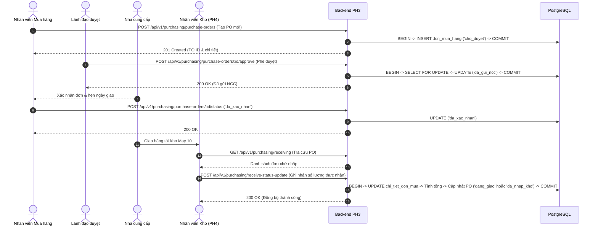

# KIẾN TRÚC HỆ THỐNG VÀ LUỒNG DỮ LIỆU PHÂN HỆ MUA HÀNG (PH3)
**Hệ thống:** ERP May 10  
**Phân hệ:** PH3 - Purchasing & Supplier Management  
**Phiên bản:** 1.0.0  

---

## 1. Kiến trúc Tổng thể (Overall Architecture)
Phân hệ Mua hàng PH3 tuân thủ nghiêm ngặt mô hình kiến trúc phân lớp hướng dịch vụ (Layered Clean Architecture):

```
+---------------------------------------------------------------+
|                      CORE PORTAL LAYOUT                      |
| (Header, Navigation Sidebar, ModuleHeader, AuthContext, Theme)|
+-------------------------------+-------------------------------+
                                |
                                v
+---------------------------------------------------------------+
|                 FRONTEND - REACT + VITE (SPA)                 |
|                                                               |
|  Pages (/purchasing/*):                                       |
|  - PurchasingDashboard.jsx     - SuppliersPage.jsx             |
|  - PurchaseOrdersPage.jsx      - PurchaseOrderDetailPage.jsx   |
|  - ReceivingOrdersPage.jsx     - PurchasingReportsPage.jsx     |
|                                                               |
|  Service Layer:                                               |
|  - purchasingService.js (Axios REST Client, Error Handlers)   |
+-------------------------------+-------------------------------+
                                | (HTTPS / REST JSON)
                                v
+---------------------------------------------------------------+
|                 BACKEND - NODE.JS + EXPRESS                   |
|                                                               |
|  Routing & Middlewares:                                       |
|  - purchasingRoutes.js (Mounted at /api/v1/purchasing)         |
|  - requireAuth (JWT verification)                             |
|  - requireRoles('mua_hang', 'admin', 'kho')                   |
|                                                               |
|  Validation Layer:                                            |
|  - purchasingValidator.js (Input sanitization, State machine)  |
|                                                               |
|  Controller & Business Logic Layer:                           |
|  - purchasingController.js (ACID Transactions, Locking)       |
|                                                               |
|  Data Access Layer:                                           |
|  - database.js (pg.Pool connection manager)                   |
+-------------------------------+-------------------------------+
                                | (SQL Queries / FOR UPDATE)
                                v
+---------------------------------------------------------------+
|                  DATABASE - POSTGRESQL (41 Tables)            |
|                                                               |
|  - nha_cung_cap (Master suppliers)                            |
|  - don_mua_hang (Purchase Orders header)                      |
|  - chi_tiet_don_mua (PO Line Items)                           |
|  - vat_tu, kho, nguoi_dung (Master shared references)          |
|  - phieu_nhap_kho (PH4 receiving integration)                  |
+---------------------------------------------------------------+
```

---

## 2. Các Ranh giới Phân hệ (Module Boundaries)
1. **Ranh giới với Core Portal:**
   - PH3 frontend được bao bọc trong `PurchasingModule.jsx` và tích hợp vào hệ thống định tuyến `AppRoutes.jsx`.
   - Sử dụng các thành phần UI chung: `ModuleHeader`, `Table`, `Badge`, `Card`, `Modal`, `Button`, `Input`, `Select`.
   - Không can thiệp vào `src/pages/HomePage.jsx` hay các trang hệ thống của Core. Thay vào đó, PH3 cung cấp API endpoint `/api/v1/purchasing/core-kpi` cho Homepage tiêu thụ.
2. **Ranh giới với Phân hệ Kho PH4:**
   - PH3 lưu trữ thông tin đơn đặt hàng và số lượng cam kết giao.
   - PH4 phụ trách tạo phiếu nhập kho thực tế (`phieu_nhap_kho`), liên kết qua cột khóa ngoại `ma_don_mua_hang`.
   - Khi kho nhận hàng, API `/api/v1/purchasing/receive-status-update` được kích hoạt để cập nhật `so_luong_da_nhap` và tự động tính toán chuyển trạng thái PO sang `dang_giao` hoặc `da_nhap_kho`.

---

## 3. Luồng Nghiệp vụ Điển hình (End-to-End Workflow)


