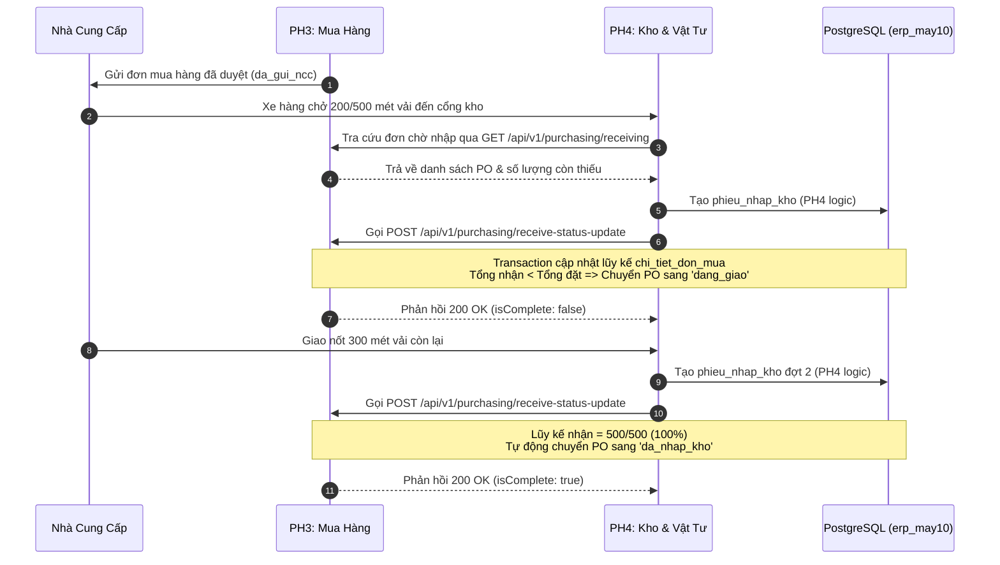

# TÍCH HỢP LIÊN PHÂN HỆ PH3 (MUA HÀNG) & PH4 (KHO VẬT TƯ)
**Hệ thống:** ERP May 10  
**Liên kết:** PH3 (Purchasing) <---> PH4 (Inventory & Warehouse)  
**Phiên bản:** 1.0.0  

---

## 1. Bản chất Mối quan hệ Liên phân hệ
- **PH3 (Mua hàng):** Phụ trách đàm phán hợp đồng, phát hành Đơn mua hàng (PO), thống nhất số lượng, đơn giá, nhà cung cấp và thời gian cam kết giao hàng.
- **PH4 (Kho & Quản lý vật tư):** Phụ trách mặt bằng kho bãi, tiếp nhận hàng thực tế tại cảng/cửa kho, kiểm đếm chất lượng ngoại quan, tạo Phiếu nhập kho (`phieu_nhap_kho`), in mã vạch và ghi nhận số dư tồn kho (`ton_kho`, `the_kho`).

---

## 2. Hợp đồng Dữ liệu (Data Contract & Foreign Keys)
Trong cơ sở dữ liệu dùng chung `erp_may10`, phân hệ PH4 tham chiếu trực tiếp đến đơn mua của PH3 thông qua trường:
```sql
CREATE TABLE phieu_nhap_kho (
  id BIGSERIAL PRIMARY KEY,
  ma_phieu_nhap VARCHAR(50) UNIQUE NOT NULL,
  ma_don_mua_hang BIGINT REFERENCES don_mua_hang(id), -- KHÓA NGOẠI TỚI PH3
  ma_kho BIGINT NOT NULL REFERENCES kho(id),
  ngay_nhap TIMESTAMPTZ DEFAULT NOW(),
  ...
);
```

### Điểm kiểm tra ràng buộc (Integrity Constraints):
1. Không thể tạo phiếu nhập kho tham chiếu tới một `ma_don_mua_hang` không tồn tại trong `don_mua_hang`.
2. Đơn mua hàng chỉ đủ điều kiện nhập kho khi đang ở các trạng thái:
   - `da_gui_ncc` (Đã gửi đơn cho nhà cung cấp)
   - `da_xac_nhan` (Nhà cung cấp đã xác nhận)
   - `dang_giao` (Đang trong quá trình giao từng đợt)
3. Không thể nhập kho cho đơn mua đang ở trạng thái `cho_duyet` hoặc `huy`.

---

## 3. Quy trình Phối hợp Nghiệp vụ (Business Integration Workflow)



---

## 4. API Tích hợp Hai chiều

### 4.1. PH4 lấy danh sách PO đủ điều kiện nhập kho:
- **`GET /api/v1/purchasing/receiving`**
- Trả về danh sách PO kèm:
  - Thông tin nhà cung cấp
  - Từng dòng vật tư kèm `so_luong_dat`, `so_luong_da_nhap`, `so_luong_con_lai`
  - Chỉ trả về các đơn còn hàng chưa nhập (`so_luong_con_lai > 0`)

### 4.2. PH4 cập nhật tiến độ nhận hàng cho PH3:
- **`POST /api/v1/purchasing/receive-status-update`**
- Tham số truyền vào:
  ```json
  {
    "ma_don_mua_hang": 1,
    "ghi_chu": "Nhập đợt 1 theo phiếu PNK-001",
    "chiTiet": [
      { "ma_vat_tu": 1, "so_luong_nhap": 200 }
    ]
  }
  ```
- Hệ thống tự động:
  1. Kiểm tra đơn hàng có tồn tại và đang mở hay không.
  2. Cộng dồn `so_luong_da_nhap = so_luong_da_nhap + so_luong_nhap`.
  3. Đánh giá tỷ lệ hoàn thành:
     - Nếu còn thiếu: gán `trang_thai = 'dang_giao'`.
     - Nếu đã đủ 100%: gán `trang_thai = 'da_nhap_kho'`.
